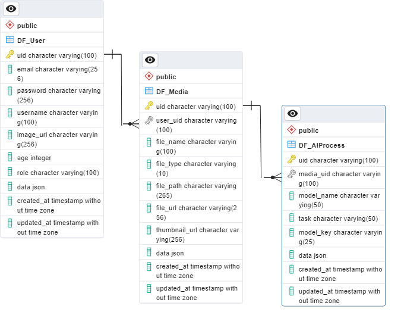

# AiWave: Data Exploration and AI-Powered Services 📊🤖

Welcome to AiWave! 🚀🤖 This repository offers an exciting journey into the realm of data exploration and analysis, fueled by the power of large language models. AiWave empowers developers to seamlessly interact with various data file formats, including PDFs and text files. Dive into the world of AI-driven data solutions with AiWave.


## Introduction

In today's data-driven world, extracting insights, understanding content, and generating meaningful outcomes from a vast sea of information is paramount. AiWave serves as your indispensable companion on this data voyage. Whether you're a developer looking to integrate powerful AI-driven features into your applications or an individual keen to harness the transformative power of artificial intelligence for data-related tasks, AiWave is here to make your journey both productive and enjoyable.


## Prerequisites

Before using the `AIWave` project, you need to obtain a **Google API key**. The Google API key is required for various functionalities, such as llm.

Create an API key from Google MakerSuite: [https://makersuite.google.com/app/apikey](https://makersuite.google.com/app/apikey). Once you have obtained your API key, you can use it in the `AIWave` project.

## Configuration

The AIWave project is designed to be highly configurable. To use your Google API key within the project, follow these steps:


## Getting Started

To get started with AiWave, follow these steps:

1. Clone this repository to your local machine:

```bash
git clone https://github.com/MohamadAboud/AIWave
```

2. Navigate to the project directory:

```bash
cd AIWave
```

3. Install the required dependencies.

### Local use:

1. Create a virtual environment:

```bash
python -m venv venv
```

2. Activate the virtual environment:

```bash
venv\Scripts\activate
```

3. Install the required dependencies:

```bash
pip install -r requirements.txt
```

4. Set the `.env` file:

    - Rename the `example.env` file to `.env`.
    - Open the `.env` file with a text editor.
    - Add your Google API key as an environment variable. You can name it `GOOGLE_API_KEY`:

        ```plaintext
        GOOGLE_API_KEY=your-google-api-key-here
        ```
    - Save the `.env` file.

5. Run the project:
    
```bash
python app.py
```

---

### Using Docker

You can also run AiWave using Docker for a hassle-free setup. Here's how:

1. Set the `.env` file:

    - Rename the `example.env` file to `.env`.
    - Open the `.env` file with a text editor.
    - Add your Google API key as an environment variable. You can name it `GOOGLE_API_KEY`:

        ```plaintext
        GOOGLE_API_KEY=your-google-api-key-here
        ```
    - Save the `.env` file.

2. Run the Docker Compose file:

```bash
docker-compose up -d
```

The AIWave web application will be accessible at [`http://localhost:7651`](http://localhost:7651) in your browser and the response will be returned as JSON.

```json
{
    "message": "Flask server is running",
    "system_info": {
        "cuda_version": "CUDA Version: Not Found ❌",
        "gpu_model": "GPU Model: Not Found ❌",
        "python_version": "Python Version: 3.10.12 🐍"
    }
}
```

That means you're all set! 🎉

## Database Structure

#### The AIWave project uses a 3 types of databases:

1. **SQL database**: The SQL database is used to store user information, conversations, media and ai_process



2. **NoSQL database**: The NoSQL database is used to store the status of the AI process.

**Status**:
```json
{
    "uid"           : "unique uid of the process",
    "media_uid"     : "unique uid of the media",
    "model_name"   : "name of the model used for the process",
    "state"        : "state of the process",
    "state_message": "message of the state",
    "state_details": "details of the state",
    "progress"     : {
        "[1]" : "progress of the process",
    },
    "timestamp"   : "timestamp of the process",
}
```

3. **Vector database**: The vector database is used to store the vectors of the words in the data-wise

...

## Project Structure

Explain the directory structure of your project. Describe the purpose of key directories and files. You can reference the project structure section in your code.

```
AIWAVE/
│
│   .dockerignore
│   .env
│   .gitignore
│   app.py
│   Dockerfile
│   example.env
│   LICENSE.md
│   README.md
│   requirements.txt
│   restart_server.py
│   tree_output.txt
│   
├──ai
│   │   mind_llm.py
│   │   process_state.py
│   │   __init__.py
│   │   
│   ├──models
│   │   │   __init__.py
│   │   │   
│   │   ├──eva_wave
│   │   │   │   eva_chat_bot.py
│   │   │   │   __init__.py
│   │   │   │   
│   │   │           
│   │   ├──word_wave
│   │   │   │   step.py
│   │   │   │   translate_srt.py
│   │   │   │   word_wave.py
│   │   │   │   __init__.py
│   │   │   │   
│   │   │           
│   │           
│           
├──config
│   │   ai_config.py
│   │   development.py
│   │   production.py
│   │   testing.py
│   │   __init__.py
│   │   
│           
├──database
│   │   __init__.py
│   │   
│   ├──local_db
│   │   │   __init__.py
│   │   │   
│   │   ├──models
│   │   │   │   __init__.py
│   │   │   │   
│   │   │   ├──conversation
│   │   │   │   │   conversation.py
│   │   │   │   │   conversation_controller.py
│   │   │   │   │   __init__.py
│   │   │   │   │   
│   │   │   │           
│   │   │   ├──media
│   │   │   │   │   add_media.py
│   │   │   │   │   delete_media.py
│   │   │   │   │   media.py
│   │   │   │   │   retrieve_media.py
│   │   │   │   │   __init__.py
│   │   │   │   │   
│   │   │   │           
│   │   │   ├──status
│   │   │   │   │   add_status.py
│   │   │   │   │   delete_status.py
│   │   │   │   │   retrieve_status.py
│   │   │   │   │   status.py
│   │   │   │   │   update_status.py
│   │   │   │   │   __init__.py
│   │   │   │   │   
│   │   │   │           
│   │   │   ├──user
│   │   │   │   │   add_user.py
│   │   │   │   │   delete_user.py
│   │   │   │   │   retrieve_user.py
│   │   │   │   │   update_user.py
│   │   │   │   │   user.py
│   │   │   │   │   __init__.py
│   │   │   │   │   
│   │   │   │           
│   │   │           
│   │           
│   ├──vector_db
│   │       vector_db.py
│   │       __init__.py
│   │       
│           
├──deployment
│       deployment_config.py
│       __init__.py
│       
├──docs
│       admin_doc.pdf
│       auth_doc.pdf
│       main_doc.pdf
│       storage_doc.pdf
│       users_doc.pdf
│       word_wave_doc.pdf
│       __init__.py
│       
├──errors
│   │   __init__.py
│   │   
│   ├──flask_handlers
│   │   │   flask_handlers.py
│   │   │   __init__.py
│   │   │   
│   │           
│   ├──handlers
│   │   │   admin_exceptions.py
│   │   │   conversations_exceptions.py
│   │   │   email_exceptions.py
│   │   │   media_exceptions.py
│   │   │   password_exceptions.py
│   │   │   permissions_exceptions.py
│   │   │   request_exceptions.py
│   │   │   status_exceptions.py
│   │   │   user_exceptions.py
│   │   │   validation_exception.py
│   │   │   value_exceptions.py
│   │   │   __init__.py
│   │   │   
│   │           
│           
├──flask_app
│   │   routes.py
│   │   server_info.py
│   │   __init__.py
│   │   
│   ├──endpoints
│   │   │   __init__.py
│   │   │   
│   │   ├──admin
│   │   │   │   README.md
│   │   │   │   __init__.py
│   │   │   │   
│   │   │   ├──routes
│   │   │   │   │   get_all_users.py
│   │   │   │   │   main.py
│   │   │   │   │   __init__.py
│   │   │   │   │   
│   │   │   │           
│   │   │           
│   │   ├──auth
│   │   │   │   README.md
│   │   │   │   __init__.py
│   │   │   │   
│   │   │   ├──routes
│   │   │   │   │   main.py
│   │   │   │   │   signin.py
│   │   │   │   │   signup.py
│   │   │   │   │   __init__.py
│   │   │   │   │   
│   │   │   │           
│   │   │           
│   │   ├──eva_wave
│   │   │   │   README.md
│   │   │   │   __init__.py
│   │   │   │   
│   │   │   ├──routes
│   │   │   │   │   chatbot.py
│   │   │   │   │   conversations.py
│   │   │   │   │   main.py
│   │   │   │   │   __init__.py
│   │   │   │   │   
│   │   │   │           
│   │   │           
│   │   ├──storage
│   │   │   │   README.md
│   │   │   │   __init__.py
│   │   │   │   
│   │   │   ├──routes
│   │   │   │   │   ai_upload_file.py
│   │   │   │   │   get_folder_contents.py
│   │   │   │   │   main.py
│   │   │   │   │   serve_file.py
│   │   │   │   │   upload_file.py
│   │   │   │   │   __init__.py
│   │   │   │   │   
│   │   │   │           
│   │   │           
│   │   ├──users
│   │   │   │   README.md
│   │   │   │   __init__.py
│   │   │   │   
│   │   │   ├──routes
│   │   │   │   │   delete_user.py
│   │   │   │   │   get_user.py
│   │   │   │   │   main.py
│   │   │   │   │   update_user.py
│   │   │   │   │   __init__.py
│   │   │   │   │   
│   │   │   │           
│   │   │           
│   │   ├──word_wave
│   │   │   │   README.md
│   │   │   │   __init__.py
│   │   │   │   
│   │   │   ├──routes
│   │   │   │   │   main.py
│   │   │   │   │   run.py
│   │   │   │   │   status.py
│   │   │   │   │   __init__.py
│   │   │   │   │   
│   │   │   │           
│   │   │           
│   │           
│   ├──static
│   │   ├──css
│   │   │       bootstrap.min.css
│   │   │       style.css
│   │   │       
│   │   └──js
│   │           bootstrap.bundle.min.js
│   │           
│   ├──templates
│   │   │   footer.html
│   │   │   header.html
│   │   │   layout.html
│   │   │   messages.html
│   │   │   
│   │   ├──documentation
│   │   │       admin_endpoint.html
│   │   │       readme_template.html
│   │   │       
│   │   └──errors
│   │           404.html
│   │           500.html
│   │           
│           
├──instance
│       development.db
│       
├──logs
│   │   create_logs.py
│   │   remove_log_folders.py
│   │   __init__.py
│   │   
│   ├──debug
│   │       2023-10-13.log
│   │       
│   ├──error
│   │       2023-10-13.log
│   │       
│   ├──info
│   │       2023-10-13.log
│   │       
│   ├──warning
│   │       2023-10-13.log
│   │       
│           
├──storage
│   ├──backend
│   └──frontend
├──temp
├──tests
│   ├──images
│   └──videos
│           Speak  English with me  Improve your English speaking with me.mp4
│           
├──ui
│   │   __init__.py
│   │   
│   └──components
│       │   __init__.py
│       │   
│       ├──component1
│       │       __init__.py
│       │       
│       └──component2
│               __init__.py
│               
├──utils
│   │   chat_memory.py
│   │   create_secret_key.py
│   │   custom_response.py
│   │   file_manager.py
│   │   file_type.py
│   │   hash_password.py
│   │   project_paths.py
│   │   secure_utilies.py
│   │   supported_languages.py
│   │   system_info_checker.py
│   │   utilities.py
│   │   validator.py
│   │   __init__.py
│
└── venv/                 # Virtual environment (create using `python -m venv venv`)
```


## Author 🧑‍💻
AiWave is the brainchild of `Mohamad Aboud`. Discover more about the author and their other projects on [GitHub](https://github.com/mohamadaboud).💻😊

We hope you enjoy your AiWave experience! Happy exploring! 🎉🔍📊

## License

This project is licensed under the [Custom License](LICENSE.md).