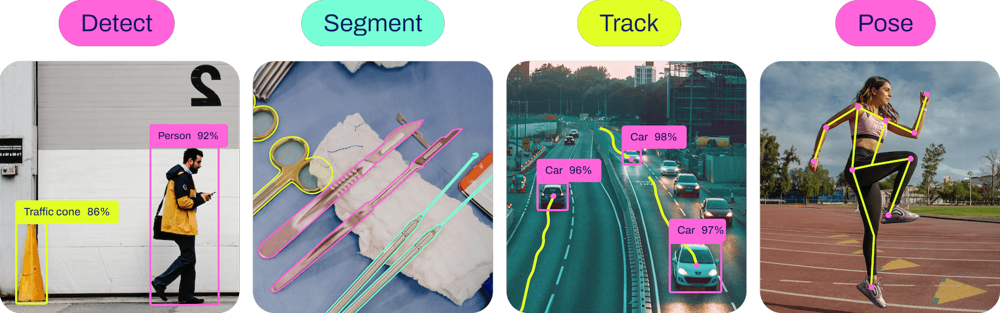

# VISIONWAVE Endpoints Documentation 🌊

## Introduction

Real-time object detection and image segmentation model. `VisionWave` is built on cutting-edge advancements in deep learning and computer vision, offering unparalleled performance in terms of speed and accuracy.



</br>

- `Detect`:

    Object detection is a task that involves identifying the location and class of objects in an image or video .
    The output of an object detector is a set of bounding boxes that enclose the objects in the image, along with class labels and confidence scores for each box. 

- `Segment`:

    Instance segmentation goes a step further than object detection and involves identifying individual objects in an image and segmenting them from the rest of the image.
    The output of an instance segmentation model is a set of masks or contours that outline each object in the image, along with class labels and confidence scores for each object. 


- `Pose`:

    pose estimation is a task that involves identifying the location of specific points in an image, usually referred to as keypoints. The keypoints can represent various parts of the object such as joints, landmarks, or other distinctive features. The locations of the keypoints are usually represented as a set of 2D [x, y] or 3D [x, y, visible] coordinates.

- `Track`:

    Object tracking in the realm of video analytics is a critical task that not only identifies the location and class of objects within the frame but also maintains a unique ID for each detected object as the video progresses.

---

### Run Vision-Wave 🏃‍♂️

- **HTTP Method**: POST
- **URL Pattern**: `/run`

**Description**: Run the vision-wave process.

**Request**:

- This endpoint requires authentication.

**Response**:

- Success (🟢  Status Code: 200 OK):
    - `message` (string): Success message.
    - `status` (object): vision-wave status.

- Error (🔴 Status Code: 400 Bad Request or 500 Internal Server Error):
    - `error` (string): Error details.

**Example Request**:

```bash
POST /run
```
```json
{
  "media_id": "xxx-xxx-xxx-xxx", // Required 
  "filters": [0, 1, ...], // Optional List of filters to apply on the video. Default: None. 
  "tracking": true, // Optional. Default: false. If true, the video will be tracked.
  "task": "detect", // Optional. Default: `detect``. Available tasks: (detect, pose, seg).
}
```

**`NOTE`: Available filters between 0 and 79. You can find the list of filters in the `/classes` endpoint. NOTE: The number of filters must be integer and between 0 and 79.**

**Example Response** (Success):

```json
{
    "message": "Vision Wave is running",
    "status": {
        "uid"      : "xxx-xxx-xxx-xxx",
        "model_name"    : "vision_wave",
        "state"         : "pending",
        "state_message" : "Initalized the Vision process started.",
        "state_details" : null, // When the process is completed, this field will contain json like `state_details` Example.
        "progress": {
            "[1] Initializing the VisionWave process"   : "pending",
            "[2] VisionWave process started"            : "pending",
            "[3] VisionWave process completed"          : "pending"
        },
        "timestamp"    : "2023-01-09 12:12:04",
    }
}
```

---

### Get Vision-Wave Status 📊

- **HTTP Method**: GET
- **URL Pattern**: `/status/<status_uid>`

**Description**: Retrieve the status of a vision-wave process.

**Request**:

- This endpoint requires authentication.

**Response**:

- Success (🟢 Green Color):
    - `message` (string): Success message.
    - `status` (object): vision-wave status.

- Error (🔴 Red Color):
    - `error` (string): Error details.

**Example Request**:

```bash
GET /status/xxxx-xxxx-xxxx-xxxx
```

**Example Response** (Success):

```json
{
    "message": "Status is retrieved",
    "status": {
        "uid"           : "xxx-xxx-xxx-xxx",
        "model_name"    : "vision_wave",
        "state"         : "pending",
        "state_message" : "Initalized the Vision process started.",
        "state_details" : null, // When the process is completed, this field will contain json like `state_details` Example.
        "progress": {
            "[1] Initializing the VisionWave process"   : "pending",
            "[2] VisionWave process started"            : "pending",
            "[3] VisionWave process completed"          : "pending"
        },
        "timestamp"    : "2023-01-09 12:12:04",
    }
}
```

**Example Response** (state_details):

```json
{
    "filters": null,
    "output_file": {
        "path": "storage\\backend\\<user_uid>\\<File_Type>\\vision_wave\\xxxx-xxxx-xxxx-xxxx\\processed_<Task>_<File_Name>.avi"
    },
    "traking": false
}
```

---

### Get Vision-Wave Classes 📊

- **HTTP Method**: GET
- **URL Pattern**: `/classes`

**Description**: Retrieve the classes of vision-wave model.

**Response**:

- Success (🟢 Green Color):
    - `message` (string): Success message.
    - `status` (object): vision-wave status.

- Error (🔴 Red Color):
    - `error` (string): Error details.

**Example Request**:

```bash
GET /classes
```

**Example Response** (Success):

```json
{
  "message": "Classes are retrieved",
  "status": 200,
  "data": {
    "0": "person",
    "1": "bicycle",
    "2": "car",
    // ...
    "79": "toothbrush"
  }
}
```

---

---

### Get Vision-Wave Media 📊

- **HTTP Method**: GET
- **URL Pattern**: `/media/`

**Description**: Retrieve the media of vision-wave model.

**Request**:

- This endpoint requires authentication.

**Response**:

- Success (🟢 Green Color):
    - `message` (string): Success message.
    - `status` (object): vision-wave status.

- Error (🔴 Red Color):
    - `error` (string): Error details.

**Example Request**:

```bash
GET /media
```

**Example Response** (Success):

```json
{
    "message": "Media is retrieved",
    "status": 200,
    "media_list": [
        {
            // The media map
        }
    ],
}
```

---

### Get Vision-Wave media details by uid 📊

- **HTTP Method**: GET
- **URL Pattern**: `/media/<string:media_uid>`

**Description**: Retrieve the details of a vision-wave process.

**Request**:

- This endpoint requires authentication.

**Response**:

- Success (🟢 Green Color):
    - `message` (string): Success message.
    - `status` (object): vision-wave status.

- Error (🔴 Red Color):
    - `error` (string): Error details.

**Example Request**:

```bash
GET /media/xxxx-xxxx-xxxx-xxxx
```

**Example Response** (Success):

```json
{
    "message": "media is retrieved",
    "status": 200,
    "media": {
        "uid": "xxxx-xxxx-xxxx-xxxx", 
        "media_uid": "xxxx-xxxx-xxxx-xxxx", // The media uid
        "model_key": "xx",
        "model_name": "xxx_xxx",
        "created_at": "2023-01-09 12:12:04",
        "updated_at": null,
        "data": {
            // The same as the `state_details` field
        },
    },
}
```

---

### Get Vision-Wave media content by uid 📊

- **HTTP Method**: GET
- **URL Pattern**: `/media/<string:media_uid>/<string:process_uid>/content`

**Description**: Retrieve the content of a vision-wave process.

**Request**:

- This endpoint requires authentication.

**Response**:

- Success (🟢 Green Color):
    - `message` (string): Success message.
    - `status` (object): vision-wave status.

- Error (🔴 Red Color):
    - `error` (string): Error details.

**Example Request**:

```bash
GET /media/xxxx-xxxx-xxxx-xxxx/xxxx-xxxx-xxxx-xxxx/content
```

**Example Response** (Success):

```json
{
    "message": "media content is retrieved",
    "status": 200,
    "process": {
        "uid": "xxxx-xxxx-xxxx-xxxx", 
        "media_uid": "xxxx-xxxx-xxxx-xxxx", // The media uid
        "model_key": "xx",
        "model_name": "xxx_xxx",
        "task": "detect",
        "created_at": "2023-01-09 12:12:04",
        "updated_at": null,
        "data": {
            // The same as the `state_details` field
        },
    },
}
```
